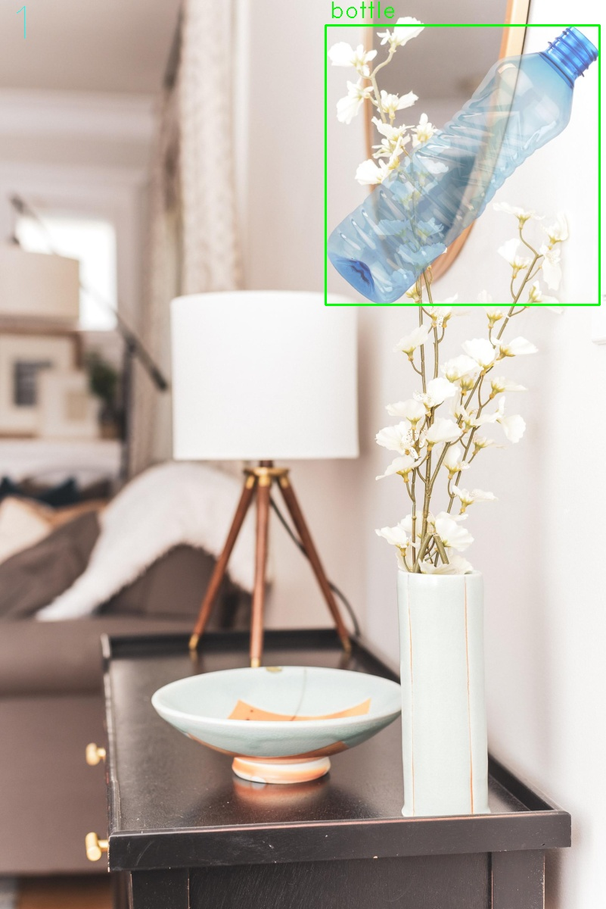

# Synthetic data set generator

Generate a dataset of images for YOLO using other images, using background images and object images (images of the objects for the dataset)

Example:



Images are not realistic however they could be helpful for data augmentation

## Table of Contents
- [Requirements](#requirements)
- [Set up](#set-up)
    - [Clone repo](#clone-repo)
    - [Folder structure](#folder-structure)
    - [Create a python virtual environment](#create-a-python-virtual-environment)
    - [Variable configuration](#variable-configuration)
- [Prerun](#prerun)
- [Run](#run)
    - [Watch](#watch)


## Requirements
- python

## Set up
### Clone repo
```bash
git clone https://github.com/rogerramosruiz/synthtetic_dataset.git
cd  synthtetic_dataset
```

### Folder structure

Two folders are needed one with background images and other with the images of objects to detect. Object images must be in format png, due to its support for transparent pixels

Recomended folder structure

```
└───synthtetic_dataset
    ├───images
        ├───background
        │       image 1.jpg
        │       image 2.jpg
        │       image 3.jpg
        │           .
        │           .
        │           .    
        └───objects
            ├───object 1
            │       image 1.png
            │       image 2.png
            │
            ├───object 2
            │       image 1.png
            │       image 2.png
            │       image 3.png
            │
            ├───object 3
            │       image 1.png
            │       image 2.png
            │
            ├─── ....
            │       ......png
            │       ......png 
```

### Create a python virtual environment
Linux
```bash
python3 -m venv venv
source venv/bin/activate
pip3 install -r requirements.txt
```

Windows
```powershell
python -m venv venv
venv\Scripts\activate
pip3 install -r requirements.txt
```

### Variable configuration

The default values in data.py would work with the recomended folder structure, and it will create a new foder named dataset. For different folder structures edit data.py and adjust the next values.
```python
# path where the object images are
images_dir     = 'images/plastics'
# path where the background images are
background_dir = 'images/background'
# path where new images will be generated
save_dir       = 'dataset'
```

Other vairalbes can be edited as well like
```python
# Probability of having more than one object per background image
prob_many_objs   = 0.4
# Probabylity of one object image to be added
prob_add_obj     = 0.5
# probability of resizing genreated image
resize_prob      = 0.96
# lenght of the names of the files to be generated
filename_size    = 10
# How manny images will be genereated per class 
images_per_class = 10
```

## Prerun
This process is optional, never the less, it will ensure that object images are good to be used and will crop images with excess padding of transparent pixels

Linux
```bash
python3 prerun.py
```

Windows 
```bash
python prerun.py
``` 

## Run

Linux
```bash
python3 main.py
```

Windows 
```bash
python main.py
``` 
A folder with the dataset will be created and and file obj.names with the correspondent names of the classes

### Watch
To observe some of the images generated with its bounding box run:

Linux
```bash
python3 opcv.py
```

Windows 
```bash
python opcv.py
``` 